# Wealth Management Copilot

An AI-powered personal finance and wealth management platform that helps users track expenses, manage financial goals, assess investment risk, and receive intelligent portfolio recommendations.

## Live Demo

https://wealth-management-copilot.onrender.com

## Features

### User Authentication

* User Registration
* Secure Login
* Session Management

### Expense Management

* Add and Track Expenses
* Categorized Expense Records
* Spending Insights

### Financial Goals

* Create Financial Goals
* Track Target Amounts
* Monitor Goal Progress

### Risk Assessment

* Interactive Risk Profiling Questionnaire
* Automatic Risk Categorization

  * Conservative
  * Moderate
  * Aggressive

### Portfolio Recommendation Engine

* Generates Portfolio Allocations Based on Risk Profile
* Diversified Asset Distribution
* Personalized Investment Suggestions

### AI Financial Advisor

* Integrated Google Gemini AI
* Portfolio Explanation and Insights
* Financial Guidance Based on User Profile

### Cloud Deployment

* Frontend & Backend Hosted on Render
* MySQL Database Hosted on Railway
* Environment Variable Security

---

## Tech Stack

### Frontend

* HTML
* CSS
* JavaScript
* Bootstrap

### Backend

* Python
* Flask

### Database

* MySQL

### AI Integration

* Google Gemini API

### Deployment

* Render
* Railway

### Version Control

* Git
* GitHub

---

## System Architecture

User → Flask Application → MySQL Database

User → Flask Application → Gemini AI → Financial Insights

---

## Database Tables

### Users

Stores:

* Name
* Email
* Password
* Income

### Expenses

Stores:

* Expense Category
* Amount
* Expense Date

### Goals

Stores:

* Goal Name
* Target Amount
* Target Years

### Risk Profile

Stores:

* User Risk Category
* Risk Score

### AI Logs

Stores:

* AI Feature Usage History

---

## Project Workflow

1. User Registers/Login
2. User Adds Income & Expenses
3. User Creates Financial Goals
4. User Completes Risk Assessment
5. System Calculates Risk Category
6. Portfolio Engine Generates Allocation
7. Gemini AI Explains Portfolio Strategy
8. User Receives Personalized Financial Guidance

---

## Key Learning Outcomes

* Full Stack Development
* REST-Based Web Applications
* Database Design and Integration
* AI API Integration
* Cloud Deployment
* Financial Technology Applications

---

## Future Enhancements

* Stock Market Data Integration
* Expense Forecasting
* Goal Achievement Prediction
* Personalized Investment Roadmaps
* Financial Report Generation
* Advanced AI Financial Planner

---

## Application Screenshots

### Dashboard

| Dashboard 1 | Dashboard 2 |
|-------------|-------------|
| 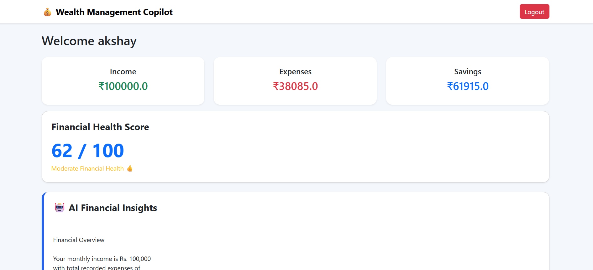 | 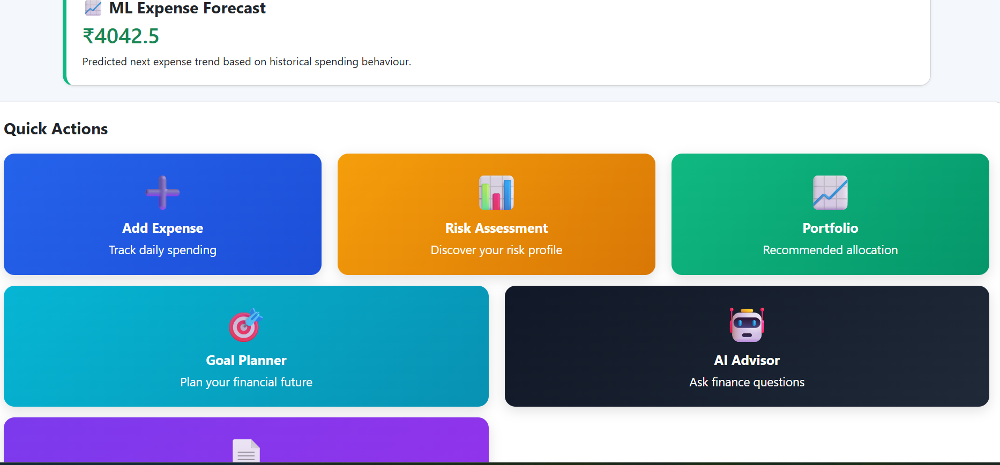 |

| Dashboard 3 | Dashboard 4 |
|-------------|-------------|
| 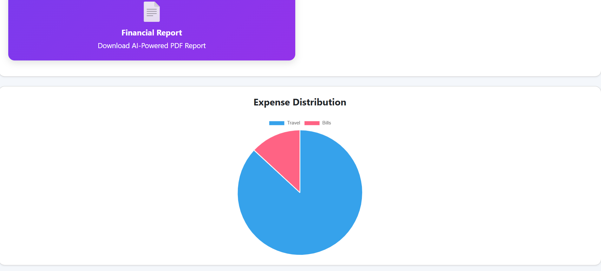 | 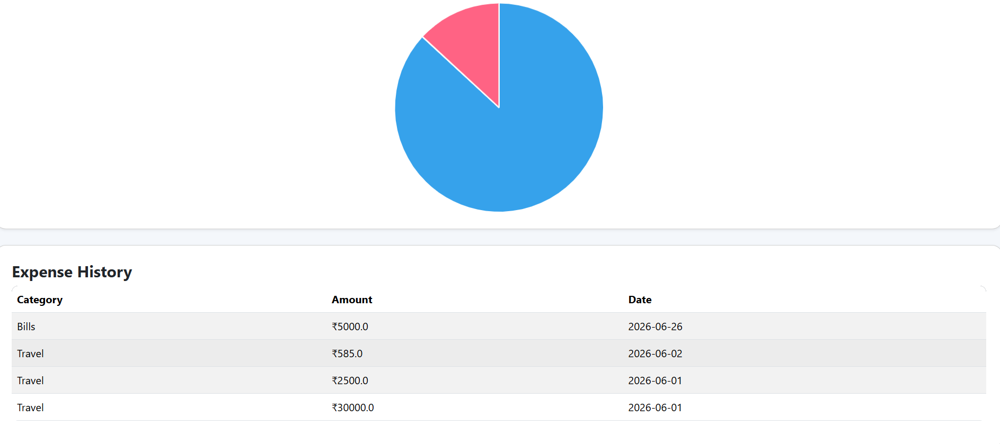 |

### Expense & Goals

| Expense Tracker | Financial Goals |
|----------------|----------------|
| 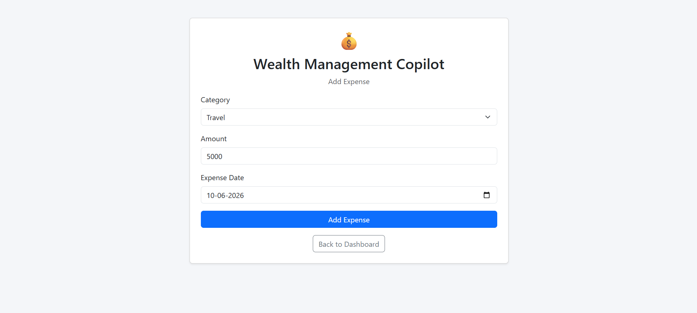 | 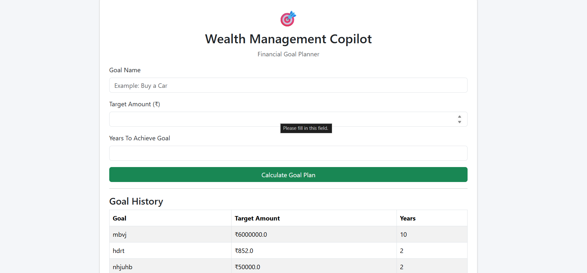 |

### Risk Assessment

| Risk Assessment 1 | Risk Assessment 2 |
|------------------|------------------|
| 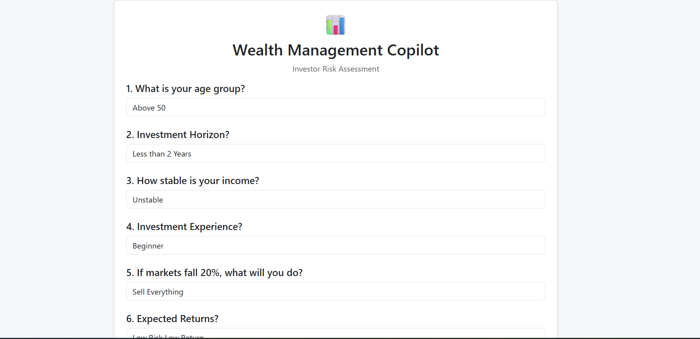 | 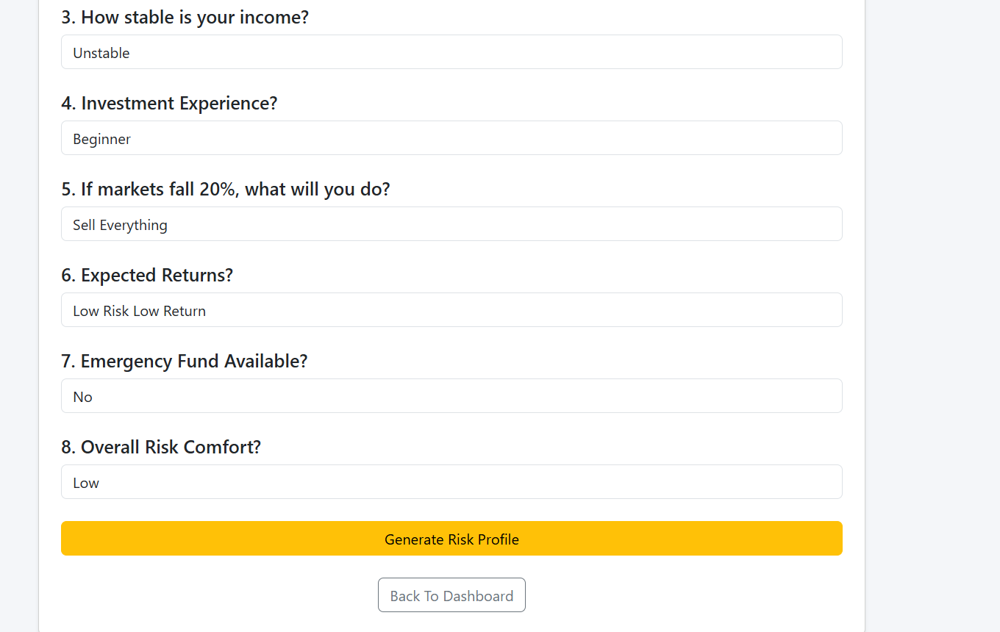 |

### Portfolio Recommendation

| Portfolio 1 | Portfolio 2 |
|-------------|-------------|
| 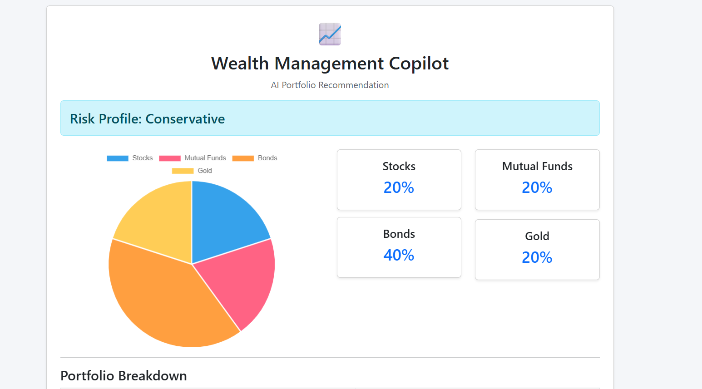 | 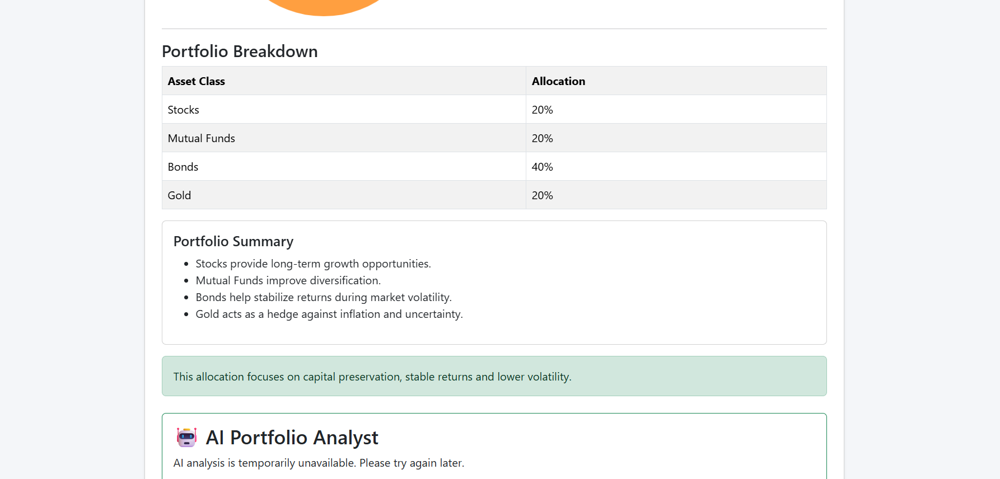 |

### AI Financial Advisor

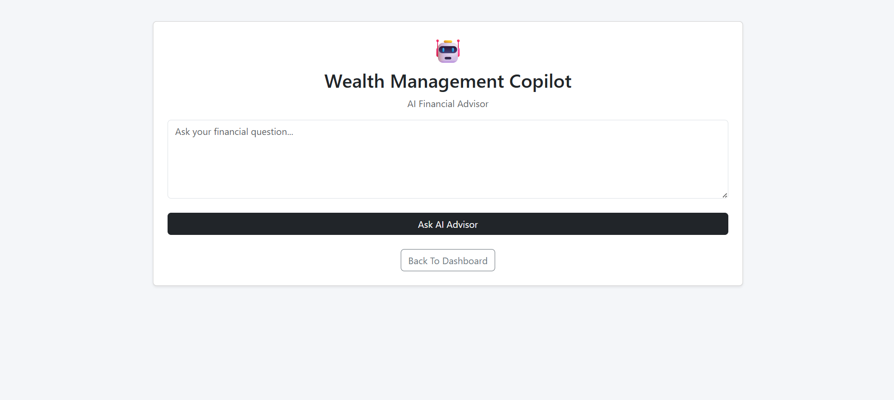
## Author

Akshay Kumar Kailasa
Rishith Ambala

GitHub:
https://github.com/Akshaykumarkailasa
https://github.com/rishithambala
